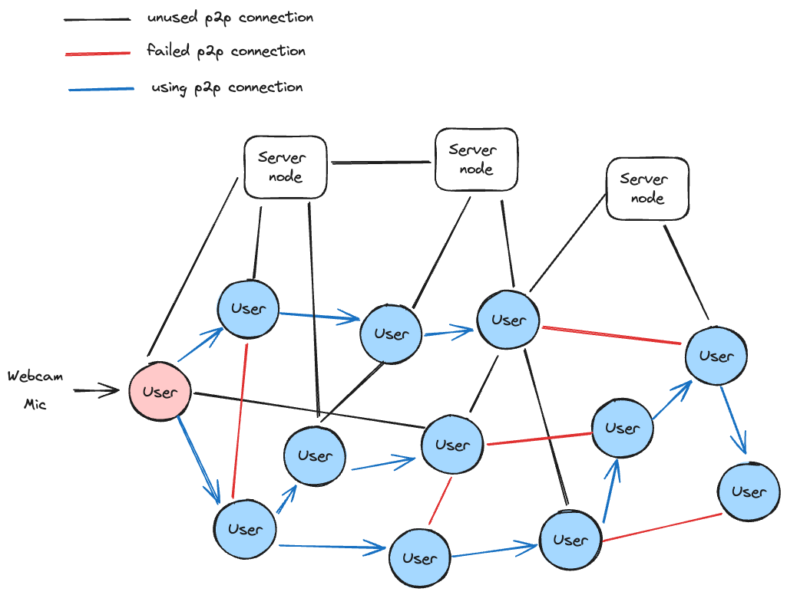

# Decentralized p2p streaming stack

This is a streaming stack for building decentralized peer-to-peer (p2p) streaming applications, such as video conferences and live streaming. The goal is to minimize server usage and maximize p2p usage while maintaining low latency and high streaming quality. In theory, with a p2p NATS traversal success rate of around 70%, the cost of streaming service can be reduced to zero if there are enough users.

## Status

This project is in its early stages of development and is not yet ready for production. However, you can try it out and provide feedback.

We welcome any contributions, including code, documentation, and feedback. If you have any questions, please feel free to open an issue.

If you are interested in this project, please give it a star to show your support. It would make us very happy.

## How it works

The stack utilizes ideas from the original atm0s-sdn to create a decentralized p2p network using protocols like WebRTC and WebSocket.

The main idea is that the publisher's best next hop is synchronized with all neighbors, and each neighbor continues to sync with their own neighbors. This allows subscribers to know the best next hop to connect to the publisher.

For more details on the protocol, refer to the [rfc draft](./crates/protocol/docs/rfcs/2023-decentralized-fast-pubsub.md).

## Modules

- Native module: used in native applications or as a relay server.
- Web module: used in web applications.
- Protocol: defines the protocol for p2p streaming.

## Checklist

- [x] Basic protocol, rfc draft
- [ ] Native module with WebRTC
- [ ] Web module with WebRTC
- [ ] Audio streaming
- [ ] Video streaming
- [ ] High-quality, multi-layered video streaming

## Roadmap

- [ ] Bootstrap: Implement the first version of the protocol with audio only (Opus)
- [ ] Optimize: Improve decentralized network topology and test in real-world scenarios
- [ ] Protocol: Finalize the protocol and publish the rfc draft as version 1.0.0
- [ ] Enhancement 1: Implement video streaming (AV1)
- [ ] Enhancement 2: Implement high-quality, multi-layered video streaming (AV1)
- [ ] Enhancement 3: Make it as library for easy integration into other projects
